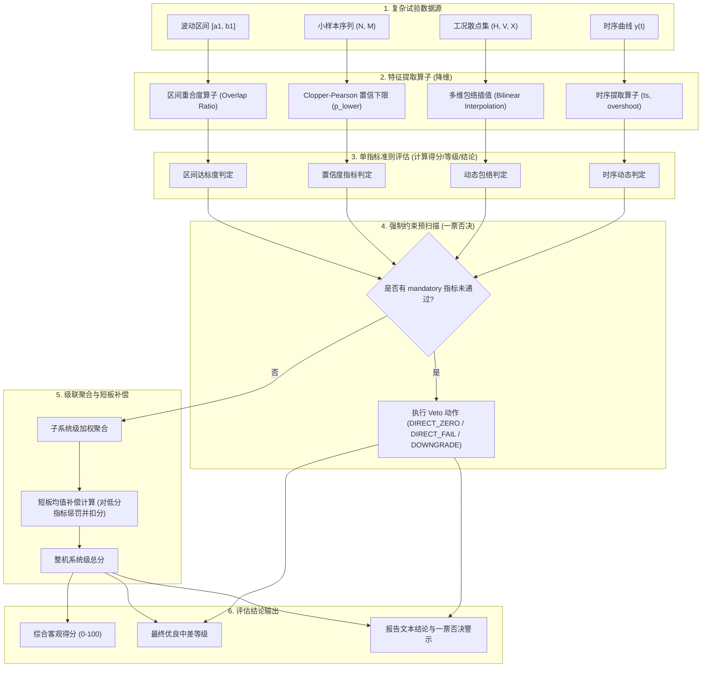

# 评估准则构建与引擎设计（评估准则集 / 规则引擎 / 交互设计）

> 对应需求：评估任务构建分系统 - 评估准则构建模块 `PGZC-ZHPG-RWGJ-ZZGJ`。
> 本文档旨在厘清评估准则的底层计算原理，明确界面交互在处理不同门限准则时的差异，以及设计一票否决、概率计算等工程落地机制。

---

## 1. 评估准则与指标量化算法的融合设计（SSOT 方案）

这是一个极其重要的系统级闭环设计：**评估准则（决定等级与阈值）必须与指标量化算法（将测量值转化为0-100标准分）在参数上同源（Single Source of Truth），以避免“量化得分”与“评价等级”在计算上产生逻辑冲突。**

### 1.1 现状与冲突隐患
在常规设计中，如果量化阶段（阶段三：归一化）和等级划分阶段（评估准则）相互独立配置：
*   **冲突案例**：归一化算法使用指标库定义的 $min=0, max=100$ 计算出了 $95$ 分。但专家在评估准则中配置的“优秀”阈值区间是 $[98, 100]$，导致最终计算出“95分（高分）”却被评为“良/中（一般等级）”的尴尬现象。
*   **解决方案**：**直接将评估准则配置的“阈值区间”动态作为指标量化算法的 `best_value` (max) 和 `worst_value` (min) 输入**，实现参数在准则层的一键托管与闭环流转。

---

### 1.2 三大指标类型（效益/成本/区间）的自动参数解析规则

在计算引擎运行时，系统加载指标绑定的准则 JSON（以等级映射 `LEVEL_MAP` 为例），并根据指标类型（`value_category`）动态提取出量化算法需要的 `best` 与 `worst` 极值：

```
                    ┌──────────────────────────────┐
                    │  用户配置指标的评估准则(LEVEL_MAP)│
                    └──────────────┬───────────────┘
                                   │
                             [ 引擎自动解析 ]
                                   │
             ┌─────────────────────┼─────────────────────┐
             ▼                     ▼                     ▼
         【效益型】             【成本型】             【区间效益型】
      (数值越大越好)          (数值越小越好)         (特定区间最好)
             │                     │                     │
      best = 优秀段上限     best = 优秀段下限     best_range = 优秀段区间
      worst = 最差段下限    worst = 最差段上限    worst_limit = 合格/差边界
```

#### ① 效益型指标（效益型 / 极大型）
*   **数学量化公式**：
    $$Score = \frac{x - worst}{best - worst} \times 100$$
*   **准则参数提取逻辑**：
    *   `best` = 等级最高的区间上限（如 `tiers[0].max`，通常对应“优”的上限）。
    *   `worst` = 等级最低的区间下限（如 `tiers[last].min`，通常对应“差”的下限）。
*   **案例**：雷达发现距离，准则配置 `[0, 50)`为差，`[50, 80)`为中，`[80, 120)`为良，`[120, 150]`为优。引擎自动解析提取：`best = 150`, `worst = 0`。

#### ② 成本型指标（成本型 / 极小型）
*   **数学量化公式**：
    $$Score = \frac{worst - x}{worst - best} \times 100$$
*   **准则参数提取逻辑**：
    *   `best` = 等级最高（即数值最小段）的区间下限（通常为0或测试极限物理底线，如 `tiers[0].min`）。
    *   `worst` = 等级最低（即数值最大段）的区间上限（如 `tiers[last].max`）。
*   **案例**：系统响应时延，准则配置 `[0, 20ms]`为优，`(20ms, 100ms]`为良，`(100ms, 500ms]`为差。引擎自动解析提取：`best = 0`, `worst = 500`。

#### ③ 区间效益型指标（落在某一范围内最好）
*   **数学量化公式**：
    *   若 $x \in [a, b]$，则 $Score = 100$。
    *   若 $x < a$ 或 $x > b$，按偏离距离衰减，直到超出最外层边界时分值为 0。
*   **准则参数提取逻辑**：
    *   最佳稳定区间 $[a, b]$ = 等级最高（“优”）的对应数值区间 $[min_{best}, max_{best}]$。
    *   左侧最差衰减界限 = “差”等级的左侧最大上限。
    *   右侧最差衰减界限 = “差”等级的右侧最小下限。

---

### 1.3 软件执行管道与融合计算链路

参数同源融合后，计算引擎在后台的实际计算流转链路如下：

```
1. [加载计算任务] ───▶ 2. [读取指标的评估准则] 
                                │
                                ▼
                       3. [自动提取极值参数] 
                          效益型: best = Max_Tiers, worst = Min_Tiers
                          成本型: best = Min_Tiers, worst = Max_Tiers
                                │
                                ▼
                       4. [动态参数注入计算阶段]
                          将上述参数覆盖至阶段三的归一化量化算法输入项
                                │
                                ▼
                       5. [量化计算标准分]
                          算法计算出 0 - 100 的客观量化标准分
                                │
                                ▼
                       6. [执行等级评定与结论输出]
                          根据量化分或原始值，判定最终优良中差等级与文本结论
```

这种设计下，用户**只需在准则库里配好“优良中差对应的阈值”**，引擎即可自动推导并完成指标的量化打分与最终等级评定，彻底杜绝了数据打架现象。

---

## 2. 评估准则的数学计算原理

### 2.1 指标计算中“概率”的计算原理

在装备评估中，“概率型”指标（如雷达发现概率、误码率、导弹命中率、系统可用度）在实际测试中得到的是一个**样本观测序列**（数据集），而不是单个数值。计算这类指标概率有三种常用工程方法：

#### ① 频数统计法（最基础、最直接）
*   **适用场景**：测试样本量较大（例如 $N \ge 30$），对置信度没有特殊法律效应要求。
*   **计算公式**：
    $$\hat{p} = \frac{M}{N}$$
    其中 $N$ 为试验总次数，$M$ 为成功（达标）的次数。
*   **软件数据输入形式**：指标计算阶段接收一个二值数组 `[1, 0, 1, 1, ...]`（1代表成功，0代表失败）。

#### ② 二项分布置信区间法（航天试验标准）
*   **适用场景**：样本量较小（如只打了 8 发导弹，中了 7 发，不能简单说命中率是 87.5%），准则要求：“在 $90\%$ 的置信度下，命中率 $\ge 80\%$”。
*   **计算公式（Clopper-Pearson 准确置信区间）**：
    寻找置信下限 $p_{lower}$，使得：
    $$\sum_{k=M}^{N} \binom{N}{k} p_{lower}^k (1-p_{lower})^{N-k} = \alpha$$
    其中 $\alpha$ 为显著性水平（置信度 $1-\alpha = 0.90 \rightarrow \alpha = 0.10$）。如果求解出的 $p_{lower} \ge 0.80$，则判定该指标通过准则。
*   **软件计算实现**：使用 Apache Commons Math 库中的 `BinomialDistribution` 进行累积概率反计算。

#### ③ 连续变量拟合分布求积分法（极值/精度的概率判定）
*   **适用场景**：指标是连续数值（如落点偏差距离），需要计算偏差小于 $D_{limit}$ 的概率。
*   **计算公式**：
    假设落点偏差 $X \sim N(\mu, \sigma^2)$，基于收集到的 $N$ 个样本计算出样本均值 $\bar{X}$ 和样本标准差 $S$。则概率为：
    $$P(X < D_{limit}) = \Phi\left(\frac{D_{limit} - \bar{X}}{S}\right)$$
    其中 $\Phi$ 是标准正态分布的累积分布函数（CDF）。

---

### 2.2 更多易于实现的评估准则补充

为了不增加计算的复杂度，同时满足工程实用性，补充以下三种计算简单的准则类型：

#### ① 区间重合度准则 (Interval Overlap Criterion)
*   **物理意义**：某些指标测试时也是一个波动区间 $[a_1, b_1]$（如某种工况下的工作温度），设计要求的合格区间是 $[a_2, b_2]$。准则通过计算两个区间的重合面积来判定达标度。
*   **计算公式**：
    $$\text{Overlap\_Ratio} = \frac{\max\big(0, \min(b_1, b_2) - \max(a_1, a_2)\big)}{b_1 - a_1}$$
    若重合度 $\ge 0.80$ 则判定为合格。

#### ② 趋势单调性准则 (Monotonicity Criterion)
*   **物理意义**：评估系统输出随输入单调递增或递减。比如“干扰功率增加，误码率必须上升”。
*   **计算公式**：
    给定输入序列 $X = [x_1, x_2, \dots, x_k]$ 及对应的指标计算序列 $Y = [y_1, y_2, \dots, y_k]$。计算一阶差分：
    $$\Delta y_i = y_{i} - y_{i-1}$$
    如果所有的 $\Delta y_i \ge 0$（或满足 $\ge 0$ 的样本数占比大于 95%），则单调递增准则通过。

#### ③ 短板均值补偿准则 (Short-board with Compensation)
*   **物理意义**：常规加权平均会掩盖极低分指标。本准则对低于及格线的指标进行打折处罚，但在其他指标极其优秀时，允许给予一定的“补偿分”。
*   **计算公式**：
    $$Score = \sum (w_i \cdot s_i) - \lambda \cdot \max(0, 60 - \min(s_i))$$
    其中 $\lambda$ 为惩罚权重，$\min(s_i)$ 最薄弱指标越低，扣分越多。
---


## 3. 界面交互设计的差异化对比

尽管“时序动态”、“动态包络”、“稳健性/敏感度”和“对比相对”准则在底层都是一种“门限值判断”，但在软件界面的交互逻辑和用户输入控件上，有本质的区别：

| 准则类型 | 比较对象与门限特性 | 前端界面需要用户配什么？ | 典型前端交互控件/组件 |
| :--- | :--- | :--- | :--- |
| **基础静态门限** | 数值 VS 常数门限 (如 $A \ge 80$) | 单一阈值、比较操作符、映射得分与评价等级。 | 输入框、下拉选择符、单游标滑块。 |
| **时序动态门限** | 曲线 VS 时间相关区间 (如 $t \in [0, 5s]$) | 1. 考察的时间起止窗口（时间轴起止点）。<br>2. 允许的超调量、稳定波动时间限制。 | 二维时间-数值坐标图、时间段配置表。 |
| **动态包络门限** | 数值 VS 多工况边界函数 (如 $Th = f(H, V)$) | 1. 关联的工况自变量（如高度、速度）。<br>2. 二维工况边界对照值或公式表达式。 | 工况自变量选择下拉框、**动态行/列扩展表格（Lookup Table 编辑器）**。 |
| **稳健性/敏感度准则** | 变化斜率（导数） VS 变化率限值 | 1. 被扰动的外部环境因子（如干扰功率）。<br>2. 每单位扰动下，指标允许下降的斜率上限。 | 偏差因子绑定框、斜率比值输入框（$\Delta Y / \Delta X$ 限值）。 |
| **对比相对准则** | 新指标值 VS 历史型号/仿真基线值 | 1. 对比的参照基线数据源（如现役装备）。<br>2. 相对提升比例（如百分比 $\ge 20\%$）。 | 对比型号/任务选择器、相对变化计算方式下拉菜单。 |

---

## 4. “一票否决权”软件具体设计方案

一票否决权（Gateway/Hard-Constraint Criteria）是评估准则中最高优先级的控制逻辑。

### 4.1 数据库结构升级

在 `pgzc_eval_criterion` 表中，新增并升级以下字段以支持“一票否决”：

| 新增字段 | 类型 | 说明 |
| :--- | :--- | :--- |
| **is_mandatory** | INT (0/1) | 是否是一票否决/强制约束指标（默认0，1代表是） |
| **veto_action** | VARCHAR(50) | 否决执行动作：<br>`DIRECT_ZERO` (当前层级及整机总分直接归零)<br>`DIRECT_FAIL` (分值保留，但等级和判定结论强行设为“不合格”)<br>`DOWNGRADE` (强行降低评价等级一个档次) |

### 4.2 前端配置界面交互设计

在准则集编辑右侧面板中，当用户选中某个关键指标时，交互界面如下设计：

```
+-------------------------------------------------------------------------------+
| 当前指标: 火工品安全释放概率                                                    |
| 规则类型: (•) 单阈值判定    ( ) 区间等级映射                                     |
|                                                                               |
| [X] 设为一票否决/强制约束指标 (勾选后激活下方配置)                                |
| ┌─────────────────────────────────────────────────────────────┐               |
| │ 触发条件: 当判定结果为 [ 不合格/未通过 ] 时                  │               |
| │ 执行动作: (•) 总分直接归零 (DIRECT_ZERO)                      │               |
| │           ( ) 强行判定整机不合格 (DIRECT_FAIL)                │               |
| │           ( ) 评价等级强行降低一档 (DOWNGRADE)                 │               |
| └─────────────────────────────────────────────────────────────┘               |
+-------------------------------------------------------------------------------+
```

### 4.3 后端计算引擎执行闭环逻辑

当计算流程运行至“综合评估阶段”时，权重加权计算逻辑由常规的线性累加修改为“预扫描否决制”：

```
                        [ 运行评估计算 ]
                               │
                               ▼
               [ 扫描所有标志为 is_mandatory 的指标 ]
                               │
                 是否有任何指标触发“否决条件”？
                      /                 \
                    是                   否
                    /                     \
                   ▼                       ▼
           [ 执行 veto_action ]      [ 执行常规加权计算 ]
         总分清零/强行判定不合格/降级          Total = Sum(W_i * S_i)
                   \                       /
                    ▼                     ▼
                 [ 输出最终评估等级与结论报告 ]
            (报告加粗提示：因指标 [X] 触发一票否决机制)
```

---

## 5. 评估准则的全部设计内容汇总（数据库、后端与前端）

### 5.1 实体定义与字段扩展

```java
// 对应 Java 类：com.ruoyi.domain.zhpg.EvalCriterion
@Data
@TableName("pgzc_eval_criterion")
public class EvalCriterion extends BaseEntity {
    private Long id;
    private String criterionCode; // 准则编码
    private String criterionName; // 准则名称
    private Long setId;           // 准则集ID
    private String equipmentType; // 装备类型
    private Long indicatorId;     // 关联指标ID
    private Integer indicatorLevel; // 指标层级
    private String ruleType;      // THRESHOLD/LEVEL_MAP/CONDITION/FORMULA/OVERLAP/MONOTONICITY
    private String ruleJson;      // 规则JSON明细
    private Integer isMandatory;  // 1-是一票否决，0-否
    private String vetoAction;    // DIRECT_ZERO/DIRECT_FAIL/DOWNGRADE
    private Double bestValue;     // 最佳值注入
    private Double worstValue;    // 最差值注入
    private String status;        // 状态
}
```

### 5.2 规则配置 JSON 全量映射模式 (`rule_json`)

*   **时序动态 (`TREND_STABILITY`)**：
    `{"ruleType":"TREND_STABILITY","settlingTimeMax":3.0,"overshootMax":5.0,"targetRangePercent":2.0}`
*   **动态包络 (`DYNAMIC_ENVELOPE`)**：
    `{"ruleType":"DYNAMIC_ENVELOPE","xVariable":"height","yVariable":"velocity","lookupTable":[{"x":10000,"y":340,"limit":80},{"x":20000,"y":680,"limit":90}]}`
*   **相对对比 (`RELATIVE_COMPARE`)**：
    `{"ruleType":"RELATIVE_COMPARE","baselineSource":"MODEL_B","compareType":"PERCENTAGE","targetImprovement":20.0}`

---

## 6. 复杂评估准则的综合运用与引擎协同机制

在实际的综合评估任务中，评估准则并非孤立存在，而是针对复杂多源的试验数据（如曲线、多工况散点、小样本事件、波动区间），进行**数据降维转换**、**多准则水平组合**、以及**多层级级联聚合**的综合运用。

### 6.1 复杂数据源到特征指标值的“转换与降维”运用

复杂准则的输入不是单一的静态数值，而是结构化数据。评估引擎首先通过**特征提取算子**将其转换为标准的标量值（特征值），然后再与评估阈值/等级进行比对：

1. **时序动态准则（时间序列曲线 -> 关键特征值）**
   * **输入**：实测物理量随时间变化的动态曲线 $y(t)$。
   * **提取算子**：
     * 自动识别稳态基准值 $y_{ss}$（如调节后的稳定输出）。
     * **超调量 $\sigma\%$**：$\sigma\% = \frac{\max(y(t)) - y_{ss}}{y_{ss}} \times 100\%$。
     * **调节时间 $t_s$**：曲线进入并保持在 $[0.98 y_{ss}, 1.02 y_{ss}]$ 误差带内的最早时间。
   * **综合运用**：引擎提取出 $t_s$ 和 $\sigma\%$，然后采用多指标联合阈值（例如：要求 $t_s \le 3s$ 且 $\sigma\% \le 5\%$），最终输出该曲线控制品质的合格判定与等级。

2. **动态包络准则（散点工况集 -> 包络线插值与余量化）**
   * **输入**：多试验工况下的离散数据集 $\{(x_i, H_i, V_i)\}$，其中 $H_i, V_i$ 为工况自变量（如高度、速度），$x_i$ 为实测指标。
   * **包络算子**：对于每个测试点，在多维查找表（Lookup Table）中根据实测工况 $H_i, V_i$ 进行**双线性插值**，计算出该工况下的动态门限 $Th_i = f(H_i, V_i)$。
   * **综合运用**：计算每个测试点相对于包络边界的“安全余量”或“偏离距离”：
     $$Margin_i = Th_i - x_i \quad (\text{以成本型为例})$$
     汇总所有测试点计算“包络不超标概率” $P(Margin_i \ge 0)$，或计算平均偏离度作为该指标在动态工况下的量化标准分。

3. **稳健性/敏感度准则（扰动序列 -> 斜率回归值）**
   * **输入**：不同干扰功率 $J_j$ 下的装备效能测量值 $P_j$（如干扰下的跟踪距离）。
   * **敏感度算子**：对数据集 $\{(J_j, P_j)\}$ 进行一阶线性回归或差分计算，求得效能随环境扰动衰减的**斜率/变化率 $K$**：
     $$K = \frac{dP}{dJ} \approx \frac{\Delta P}{\Delta J}$$
   * **综合运用**：以斜率绝对值 $|K|$ 作为稳健性指标特征值。当 $|K| \le K_{limit}$ 时判定系统具备足够的稳健性；若斜率过大，说明系统极易受外界影响，敏感度超标，判定为不达标。

4. **对比相对准则（待测数据 + 历史基线 -> 相对提升率）**
   * **输入**：当前待评估型号实测数据 $X_{test}$ 与历史型号/仿真基线值 $X_{base}$。
   * **对比算子**：计算相对提升比例 $\eta$：
     $$\eta = \frac{X_{test} - X_{base}}{X_{base}} \times 100\%$$
   * **综合运用**：将相对提升率 $\eta$ 输入给评估准则（如“相对提升 $\ge 20\%$ 为优”，“提升 $5\% \sim 20\%$ 为中/良”），使得评估结论直接体现出技术演进的相对增量效益。

5. **概率置信度准则（二值样本序列 -> 置信下限）**
   * **输入**：小样本飞行试验的成功/失败序列，如发射 $N$ 次，成功 $M$ 次。
   * **置信算子**：在指定置信度 $1-\alpha$（如 $90\%$）下，利用 Clopper-Pearson 算法求解二项分布的置信下限 $p_{lower}$。
   * **综合运用**：直接使用 $p_{lower}$ 代替单纯的频数比值 $M/N$ 作为指标值进行量化与等级划分。例如，5发4中虽频数为80%，但 $90\%$ 置信度下的置信下限仅为 34.3%。采用置信下限作为输入，能有效规避小样本试验带来的虚高评价，确保航天试验结论的严谨性。

6. **区间重合度准则（实测区间 + 设计区间 -> 重合度）**
   * **输入**：指标的实测波动范围 $[a_1, b_1]$（如某轴承工作温度范围）与设计要求的合格区间 $[a_2, b_2]$。
   * **重合算子**：
     $$\text{Overlap\_Ratio} = \frac{\max\big(0, \min(b_1, b_2) - \max(a_1, a_2)\big)}{b_1 - a_1}$$
   * **综合运用**：计算重合度比例，将区间重合度 $\text{Overlap\_Ratio} \in [0, 1]$ 映射为量化得分（如 $\text{Overlap\_Ratio} \times 100$），作为评估达标等级（如 $\ge 0.9$ 为优，$\ge 0.7$ 为良）的输入判定值。

7. **趋势单调性准则（多变量变化趋势 -> 差分单调占比）**
   * **输入**：有序序列输入 $X$ 对应的输出序列 $Y$。
   * **单调算子**：计算相邻测量点的一阶差分 $\Delta y_i = y_i - y_{i-1}$，统计与预期方向一致（如大于等于0）的样本比例 $R_{mono} = \frac{Count(\Delta y_i \ge 0)}{N-1}$。
   * **综合运用**：当 $R_{mono} = 100\%$ 时判定为完美单调；当 $R_{mono} \ge 95\%$ 时可容忍少量测量噪声判定为单调通过。

---

### 6.2 评估准则的水平与垂直融合机制（组合叠加）

在一个具体的装备评估任务中，上述多种准则往往不是孤立使用的，而是通过**水平叠加**与**垂直级联**组合在一起来发挥作用：



#### 6.2.1 水平叠加（单指标 / 单节点的多准则并行）
针对高复杂度装备的某个特定能力指标，需要**并行满足多个维度**的准则。
* **案例**：导弹姿态控制能力评估。
  * **输入数据**：姿态角随时间波动的实测曲线。
  * **综合运用**：
    * 提取调节时间 $t_s$，匹配**时序动态准则**（判断是否响应迅速）。
    * 提取实测波动的稳态区间，与设计误差带比对，匹配**区间重合度准则**（判断稳态精度）。
    * 调取带有阵风扰动下的测试样本，计算风速与超调量的变化率，匹配**稳健性准则**（判断抗干扰能力）。
  * **最终决策**：仅当上述三个准则全部达标时，该能力指标才被判定为“优秀/合格”，否则按照其中最低的一项定级（短板原理）或采用乘积综合打分。

#### 6.2.2 垂直级联（从叶子到叶根的级联聚合）
在指标树的层级传递中，准则自下而上进行过滤与惩罚。
* **一票否决机制（向下约束）**：在计算总得分前，引擎首先对所有叶子节点中被标识为 `is_mandatory = 1`（一票否决）的指标准则结果进行预扫描。一旦发现有安全指标（如安全脱锁概率、火工品释放率）处于不合格状态，将直接阻断向上常规的算术加权，整机评估结果直接归零或判为不合格。
* **短板均值补偿（向上聚合）**：常规加权平均（如算术平均）容易掩盖子系统中的严重缺陷。当子系统下属的指标得分全部计算完成后，如果某些指标得分极低（如 $<60$ 分），在向上聚合时，不仅以权重比例折算，还会通过**短板均值补偿准则**对总分进行二次扣分处罚：
  $$Score_{parent} = \sum (w_i \cdot Score_{child\_i}) - \lambda \cdot \max\big(0, 60 - \min(Score_{child\_i})\big)$$
  这样既保留了常规的权衡，又突出了短板效应对整机系统效能的致命影响。

---

### 6.3 评估引擎的统一计算流水线 (Calculation Pipeline)

当用户发起某项试验的综合评估任务时，引擎在后台会按照以下 7 个步骤闭环执行这些复合准则：

1. **第一步：数据载入与归一化对齐**：获取评估任务绑定的试验数据源（时序曲线、散点表、小样本二值数组等）。
2. **第二步：特征特征算子提取**：针对绑定的非标量准则类型，引擎在后台自动运行对应的 Clopper-Pearson 算法、调节时间提取算法、一阶差分单调计算等，将复杂数据降维转化为标量指标特征值。
3. **第三步：动态比对与量化**：
   * 若指标属于动态包络，根据测试点工况（如 $H_i, V_i$）实时检索包络查找表，进行本地动态门限判断。
   * 若指标属于相对对比，自动获取关联基线型号的同一指标得分，计算技术提升率。
   * 通过归一化公式（包含 SSOT 参数融合），将特征值转化为 $0 \sim 100$ 的标准客观分。
4. **第四步：一票否决拦截预扫**：引擎轮询所有 mandatory 指标准则结果。若有触发，记录“一票否决触发源（指标名及触发阈值）”，暂停上游聚合，进入否决结算通道。
5. **第五步：短板补偿聚合计算**：若未触发否决拦截，引擎根据指标体系树的层级结构（ZBGJ），自下而上进行加权合并。在遇到配置有短板惩罚的节点时，执行短板扣分修正。
6. **第六步：等级与结论映射**：将最终修正后的系统总分、各子系统分值与评估准则设定的 `LEVEL_MAP` 匹配，输出评估等级（优/良/中/差），同时根据得分范围拉取结论文案模板（`conclusion_template`），动态替换生成结论报告。
7. **第七步：结果持久化与报告输出**：将最终得分、等级、一票否决拦截日志写入 `pgzc_calc_task` 及详细报告记录中，供前端 FlowRunner 拓扑图和 PDF/Word 评估报告生成器直接展示。

---

## 7. 评估准则全景汇总与分类选型指南

为了在系统设计、数据库存储与前端交互开发中建立清晰的对照关系，系统将核心的 **13 类评估准则** 按照**物理属性、计算特征与应用维度**，划分为以下三大类别进行分类管理：

### 7.1 第一类：基础参量与数值映射类准则 (Basic Parameters & Mappings)
这类准则通常作用于**常规静态数值指标**，直接对实测出的单个物理量数值进行大小比对、区间划分或数学拉伸打分。

| 序号 | 评估准则名称 | 规则类型 (`rule_type`) | 物理意义与算法核心 | 软件配置与输入参数 | 典型应用场景 |
| :--- | :--- | :--- | :--- | :--- | :--- |
| **1** | **基础静态门限** | `THRESHOLD` | 单一测量值与常数阈值的大小比较 | 比较操作符（$\ge, \le, =$）、阈值常数、达标/未达标得分。 | 战技指标底线考核（如射程 $\ge 80km$） |
| **2** | **等级映射** | `LEVEL_MAP` | 将测量值按分段区间映射为对应的有序定性等级与标准分 | 等级分段列表（优良中差）、各区间边界值、推荐分数。 | 普遍适用于效益型/成本型指标的分级评价 |
| **3** | **多条件组合** | `CONDITION` | 多个子指标通过逻辑门（AND/OR）组合判定最终等级/分数 | 子条件列表（指标编码+操作符+值）、逻辑关系（AND/OR）、满足/不满足动作。 | 复合安全性与系统健康度多条件判定 |
| **4** | **归一化评分** | `FORMULA` | 将物理值通过线性或非线性公式拉伸映射到 $0 \sim 100$ 标准分 | 极值参数（`best_value`, `worst_value`）、指标方向类型（效益/成本/区间效益型）。 | 线性打分制客观指标的量化标准化 |

### 7.2 第二类：动态变化与时序工况类准则 (Dynamics, Temporal & Operating Conditions)
这类准则对应**非标量数据源**（如时序曲线、工况矩阵、多扰动序列等），侧重于考察指标随时间、工况或外界环境的变化特征。

| 序号 | 评估准则名称 | 规则类型 (`rule_type`) | 物理意义与算法核心 | 软件配置与输入参数 | 典型应用场景 |
| :--- | :--- | :--- | :--- | :--- | :--- |
| **5** | **时序动态准则** | `TREND_STABILITY` | 对时序曲线的动态响应特性（超调、调节时间）进行提取比对 | 允许的超调量上限（$\sigma\%$）、最大调节时间门限（$t_s$）、误差带宽百分比。 | 伺服控制、姿态控制曲线品质考核 |
| **6** | **动态包络准则** | `DYNAMIC_ENVELOPE` | 指标边界随工况自变量动态变化，通过多维插值表判断超标概率 | 工况自变量（如高度、速度）、Lookup Table 二维对照网格。 | 飞行动力学、天线增益等全包络战力评估 |
| **7** | **稳健性/敏感度** | `ROBUSTNESS` | 评估效能指标在环境扰动下的衰减斜率（对外部干扰的敏感度） | 扰动因子输入、最大允许衰减斜率限值（$\Delta P / \Delta J$）。 | 复杂电磁干扰下的抗干扰能力评估 |
| **8** | **对比相对准则** | `RELATIVE_COMPARE` | 计算相对于历史基线或仿真基准的技术提升比例 | 基线数据源标识（型号/任务）、相对改进公式、改进比例门限（如 $\ge 20\%$）。 | 新装备研制方案比选、技术增量效益评估 |

### 7.3 第三类：特征提取与层级聚合类准则 (Data Features & Aggregations)
这类准则用于处理**小样本离散序列、波动区间、或者系统树状级联聚合**，进行特征概率提取以及防短板掩盖的权重融合。

| 序号 | 评估准则名称 | 规则类型 (`rule_type`) | 物理意义与算法核心 | 软件配置与输入参数 | 典型应用场景 |
| :--- | :--- | :--- | :--- | :--- | :--- |
| **9** | **概率置信度** | `PROBABILITY_CONFIDENCE` | 小样本二值试验下，通过二项分布计算满足特定置信度的概率下限 | 置信水平（$1-\alpha$）、单次试验成功判定阈值、合格概率门限。 | 导弹命中率、系统可用度等小样本置信考核 |
| **10** | **区间重合度** | `INTERVAL_OVERLAP` | 评估波动测试区间与设计指标区间的重合面积比率 | 实测区间上限/下限、设计合格区间上限/下限、最小重合比门限。 | 温度、电压波动等区间状态一致性评估 |
| **11** | **趋势单调性** | `MONOTONICITY` | 验证系统响应随输入单调变化的趋势符合度 | 期望单调方向（增/减）、一阶差分一致性比例门限（如 $\ge 95\%$）。 | 传感器线性度、增益平坦度趋势验证 |
| **12** | **短板均值补偿** | `SHORT_BOARD_COMP` | 垂直加权聚合中对低于及格线的薄弱项进行扣分，对优秀项进行补偿 | 惩罚因子（$\lambda$）、及格线分数、补偿系数。 | 子系统向父系统能力加权聚合（防止短板被掩盖） |
| **13** | **一票否决控制** | `VETO_CONTROL` | 树状指标体系中强约束指标的最高拦截优先级控制 | 否决执行动作（`DIRECT_ZERO`/`DIRECT_FAIL`/`DOWNGRADE`）、触发阈值。 | 安全性、致命故障率、核心功能达标拦截 |


